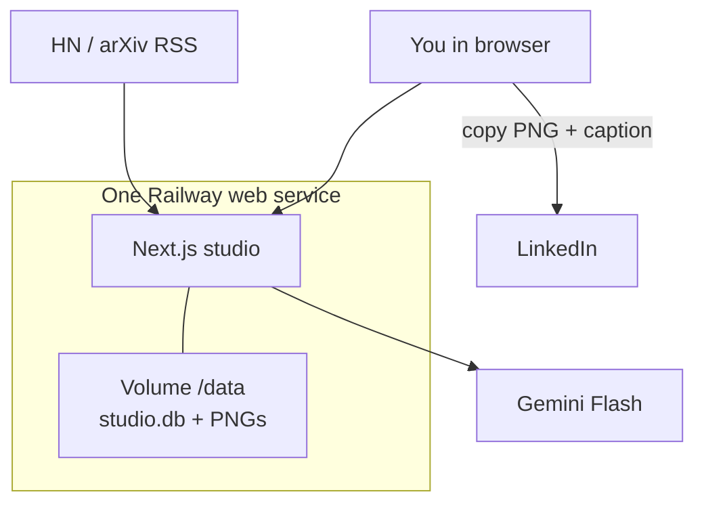
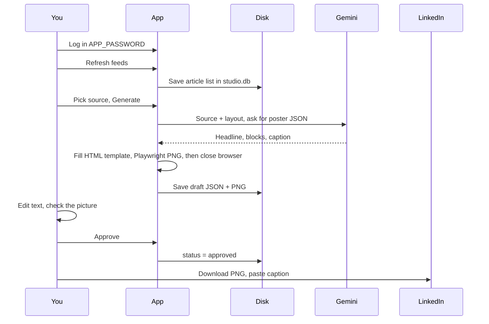

# End-to-end flow and Railway (why each piece exists)

This is the picture of **linfeedgen**. Read this once. Then use [`RAILWAY.md`](RAILWAY.md) as the click-list.

You are not building a big platform. Railway runs **one website**. That website is the studio. A disk holds drafts and images. Gemini writes poster *text*. HTML templates draw the *picture*. **You** click Approve. LinkedIn is copy-paste until you add OAuth later.

---

## 1. What you are deploying



| Piece | What it is | Why |
| --- | --- | --- |
| **Web service** | The Next.js app (`Dockerfile`) | Login, feeds, generate, review, export |
| **Volume `/data`** | A USB stick that survives redeploys | SQLite file + poster PNGs. Without it, every deploy wipes drafts |
| **Env variables** | Secrets the app reads at start | Password, Gemini key, where files live |
| **Cron (optional)** | Railway hits a URL on a timer | Refresh feeds / later auto-post. You can click buttons instead |
| **Postgres plugin** | Extra paid/blocked database | **Not used.** Leave `DATABASE_URL` empty |

Reason Railway Postgres is skipped: free accounts often cannot add it, and this app already uses **SQLite** when `DATABASE_URL` is unset. One person, 3 posts/week, one replica — SQLite is enough.

---

## 2. Product flow (one post)



**Roles in that loop**

- **Creator:** Gemini JSON + caption  
- **Designer:** template + PNG  
- **Validator:** source URL, refuse bad JSON, refuse post unless approved  
- **You:** Approve  
- **Publisher (v1):** you paste to LinkedIn  

Nothing goes to LinkedIn by itself in v1. Cron publish is a no-op until a draft is approved **and** LinkedIn OAuth is connected.

---

## 3. Map Railway’s screen to the app

Railway **Variables** tab is not a second product. It is how the running container learns secrets. GitHub has **no** passwords.

What you saw (“we found these in your source code”) is Railway copying **placeholder names** from `.env.example`. Those values (`change-me`, `./data`) are **wrong for production**. You replace them, then deploy.

| Railway variable | App uses it for | What to type | If wrong |
| --- | --- | --- | --- |
| `APP_PASSWORD` | Login page | A password only you know | Anyone who has the URL can guess `change-me` |
| `SESSION_SECRET` | Cookie signature | Long random hex | Logins bounce or cookies are forgeable |
| `CRON_SECRET` | Prove a caller is Railway cron (or you) | Different long random hex | Strangers could hit `/api/cron/*` |
| `DATA_DIR` | Folder for DB + PNGs | **`/data`** exactly | `./data` dies on each deploy (not the volume) |
| `LLM_PROVIDER` | Which adapter | `gemini` | Leave as gemini for now |
| `LLM_API_KEY` | Call Gemini | Real key from Google AI Studio | Generate button fails |
| `APP_URL` | Public origin (OAuth later) | `https://….up.railway.app` | Add after Settings → Networking gives you a URL |
| `DATABASE_URL` | Switch to Postgres | **Do not add** | If set, app expects Postgres and SQLite is skipped |

**Volume (Settings of the same service, not Variables)**

- Mount path must be **`/data`**
- `DATA_DIR` must be **`/data`**
- Same path = SQLite file lives on the volume: `/data/studio.db`

```text
Railway service
  └── container (your website)
        └── /data   ← volume (survives rebuild)
              ├── studio.db
              └── posters/*.png
```

If `DATA_DIR=./data`, the app writes inside the container image. Next deploy = empty studio.

**Replicas:** keep **1**. Two copies of SQLite on one file corrupt data.

**Dockerfile:** Chromium is on disk so PNG export works. The browser starts only when you export, then exits. That is why the image is large, not because Chrome runs 24/7.

**Health check:** `/api/health` — Railway pings this to know the site is up. JSON includes `"db": "sqlite"` when Postgres is unused.

**Spend cap:** Project settings, not Variables. Caps surprise bills if PNG render hangs.

---

## 4. What to click, in order (reasoning)

1. **Connect GitHub repo** — Railway builds the Dockerfile and runs `npm start`. That *is* the studio.
2. **Public URL** (Networking / Generate domain) — so you can open the login page.
3. **Variables** — real password, two random secrets, Gemini key, `DATA_DIR=/data`. No `DATABASE_URL`.
4. **Volume** `/data` — so login and drafts still exist tomorrow.
5. **Redeploy** — so the new env and mount apply.
6. **Open URL, log in, Refresh feeds, generate, Approve, copy to LinkedIn.**
7. **Cron (optional)** — only after the site works. Same app URLs with `Authorization: Bearer <CRON_SECRET>`.
8. **Spend limit $15–25.**

Cron is not a second server. Railway’s scheduler **HTTP GETs your existing app**. Ingest = fill the source list. Publish = try LinkedIn only for `approved` drafts.

---

## 5. Request path inside the code

| You click | Hits | Writes |
| --- | --- | --- |
| Log in | `/api/auth/login` | Session cookie |
| Refresh feeds | `/api/cron/ingest` (as you) or cron | `sources` in SQLite |
| Generate | `/api/generate` → `completePoster()` → Gemini | `drafts` rows (2–3 variants) |
| Export PNG | `/api/drafts/:id/export` → Playwright | file under `/data` |
| Approve | `/api/drafts/:id/approve` | `status=approved` |
| Publish now / cron | `/api/cron/publish` | LinkedIn **only if** approved + OAuth |

Gemini never draws the infographic. It returns JSON. `src/lib/posters/html.ts` draws. That is why letters stay readable.

---

## 6. Mental model of cost

You pay Railway for **one always-on small website** + a **tiny disk**. You pay Google for **a few Gemini calls per week**. You do not pay for Postgres, Redis, or an extra worker.

---

## 7. Later (not needed to understand Railway)

LinkedIn OAuth, other `LLM_PROVIDER`s, or Neon `DATABASE_URL` if you outgrow SQLite. None of that changes the one-service picture above.

Checklist of values: [`RAILWAY.md`](RAILWAY.md). Roles: [`ROLES.md`](ROLES.md).
